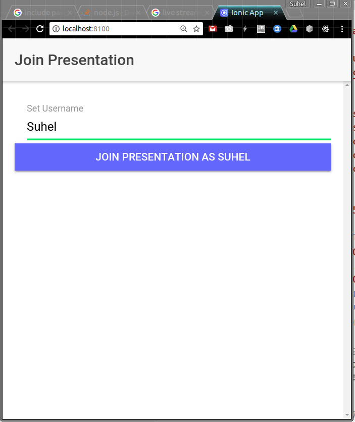

## Live Slide Share App
---

This primitive application is only for learning about ionic, it has NO:
* User authentication and session management.
* Database Integration
* Multi-presentations per application
* master/slave presentation mode
* ....
* ....

To install and to run in development mode:
#### Server Side

```bash
cd server
npm install
npm dev
``` 

#### Client Side
```bash
npm install
npm run ionic:serve
```

Then open [http://localhost:8100](http://localhost:8100)

#### Presentations

* Slides are prepared as html files with names of 1.html, 2.html, ...etc. Files are saved in one directory, and offered publicly on http server.
* Separate css and js files are allowed per slide
* User prepare a config file in json format, such as:
```json
{
    "username":"suhel",
    "url":"http://localhost:3001/seminars/1",
    "size": 3,
    "num":1,
}
```
(url: full path to presentation directory)

#### Using the app:
* Join with your nickname:



* Set json configuration file in the presentation page


* All users are synchronized to the same slide


* Nofifications of joinings and leaving users


